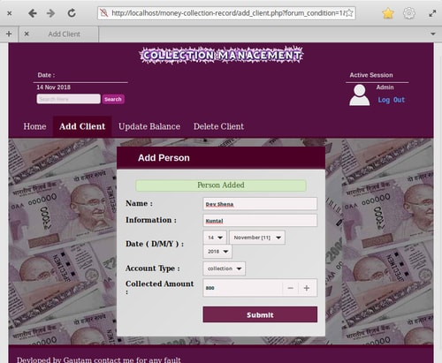
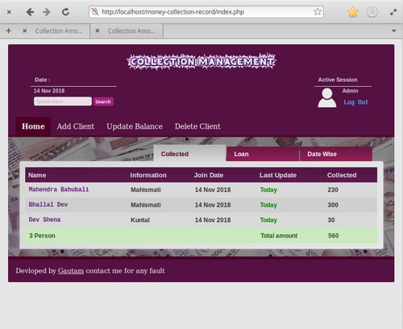
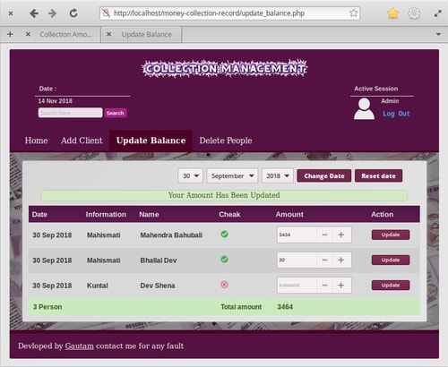
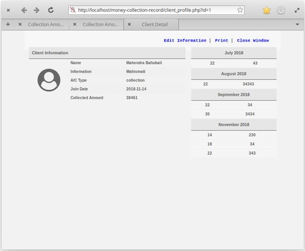

# collection-money-management

This application is made for **business** purpose to keep record of **loan** and **collected** money amount into Database. It can handle diffrent indivisual accounts and all amount updating process are flexible and smooth. A checkout page will be automatically genrated on profile page.

## Language Used :
PHP , MYSQL

## How To Use :

1. Create a MYSQL database **'coldb'** .
1. Import **mysqlQuery.sql** from **SQL folder** into that database through PHPMyadmin.
1. Copy this folder into **http** directory of server.
1. Open browser and navigate to the **url** of your application

| Username | Password |
|----------|--------|
| admin | 12345 |

***You can change username and password from admin table of database.***

 ---

## Working Interface :

